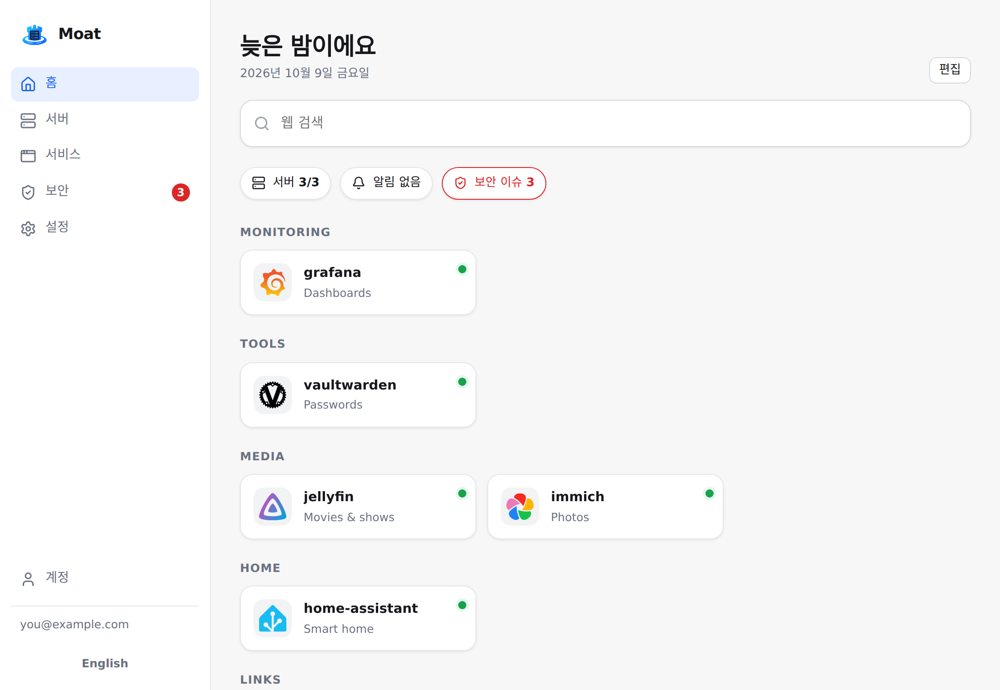
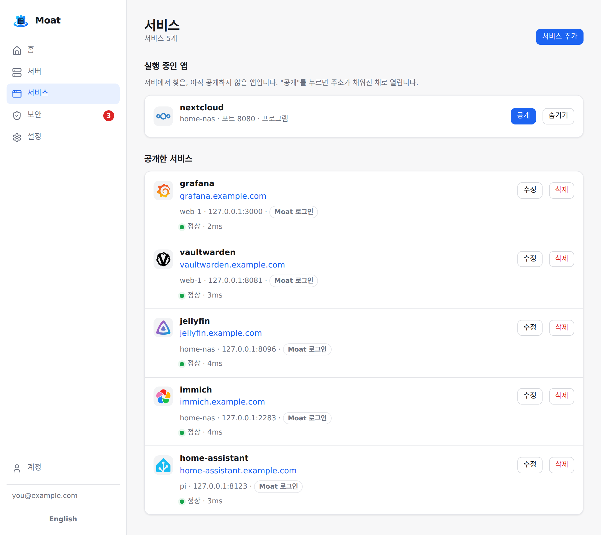
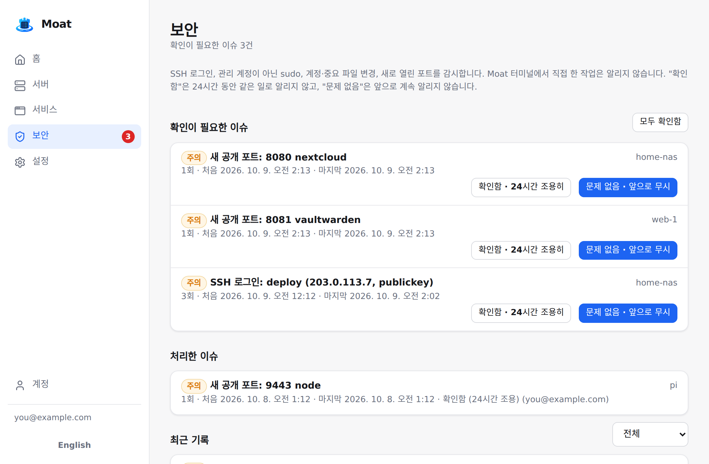

# Moat

**작은 서버들을 위한 보안 현관.**

빈 리눅스 서버에 Moat를 설치하면 이런 것들이 생깁니다. 직접 운영하는 모든 앱 앞에 패스키
로그인, 자동 인증서 HTTPS, SSH를 닫을 수 있게 해 주는 웹 터미널, *누가 무엇을 했는지* 알려 주고
확인하면 더 이상 조르지 않는 보안 감시, 리소스·서비스 모니터링, 홈 화면. 서버 한 대든 여러 대든.

[English README](README.md)

<p align="center"></p>

> **상태: v0.1 — 초기 단계.** 만든 사람의 서버에서 매일 쓰고 있지만, 아직 젊은 프로젝트이고
> 관리자는 한 명이며 **외부 보안 감사를 받지 않았습니다.** 중요한 곳에 쓰기 전에
> [SECURITY.md](SECURITY.md)를 읽어 주세요.

## 왜 Moat인가

셀프호스팅을 하다 보면 리버스 프록시, 인증 프록시, 모니터링 대시보드, 업타임 감시, 시작 페이지,
SSH 설정을 따로따로 붙이게 됩니다. 설정도 로그인도 제각각입니다. Moat는 그중 *현관* 부분을 한 번의
설치와 안전한 기본값으로 해결합니다.

- **모든 앱 앞에 패스키 로그인** — 자체 로그인이 없는 앱도. 비밀번호는 어디에도 없습니다.
  Google 로그인은 선택.
- **22번 포트를 닫으세요.** 브라우저 터미널은 열 때마다 패스키를 다시 확인하고(60초), 화면을
  녹화하며, Ubuntu·Debian뿐 아니라 SELinux를 쓰는 Rocky/RHEL에서도 동작합니다.
- **내가 한 일인지 아는 보안 감시.** SSH 로그인·실패, 관리 계정이 아닌 `sudo`, 계정·중요 파일 변경
  (`authorized_keys`, `sudoers`, `sshd_config` 등), 새로 열린 포트. Moat 터미널에서 한 작업은 나로
  표시하고 알리지 않습니다. 이슈는 *확인함*(24시간 조용) 또는 *문제 없음*(앞으로 무시)으로 처리합니다.
- **비상 출입구.** 일회용 복구 코드, 매일 자동 백업, `moat-hub backup/restore`,
  [복구 가이드](docs/recovery.ko.md). SSH를 닫는 건 언제든 다시 들어갈 수 있을 때만 의미가 있으니까요.

그리고 매일 쓰는 것들:

- **실행 중인 앱 → 공개.** 모든 서버의 컨테이너와 열린 포트를 보여 주고, *공개*를 누르면
  `https://앱.내도메인`이 로그인 뒤에 생깁니다.
- **공유기 뒤 서버도 포트포워딩 없이.** 각 서버의 Agent가 443으로 먼저 연결하므로, 공인 IP가 있는
  서버 한 대만 80/443을 열면 됩니다.
- **모니터링:** CPU·메모리·디스크·네트워크, 실패한 systemd 유닛, 컨테이너, WireGuard 피어,
  서비스 응답 확인, 텔레그램 알림.
- **홈 화면** (앱 아이콘이 있는 Homepage 스타일 시작 페이지).
- **도메인이 없으면 Tailscale 모드:** 공개 포트 0개, Tailscale 계정으로 로그인.
- **가볍습니다:** 정적 바이너리 두 개(Hub 약 12MB, Agent 약 9MB), SQLite, Docker 필요 없음.
  1GB VM에서 돌아갑니다. 한국어·영어 화면.

<p align="center">
  
  
</p>

## 설치

systemd를 쓰는 빈 리눅스 서버(Ubuntu, Debian, Rocky/RHEL; x86_64 또는 ARM64)에서:

```sh
curl -fsSL https://github.com/5sick/moat/releases/latest/download/install.sh | sudo sh
```

설치기가 몇 가지를 묻습니다 (Enter = 추천):

1. **어떻게 접속할까요?**
   - *Tailscale 안에서만* — 도메인도 공개 포트도 필요 없음. 서버에 [Tailscale](https://tailscale.com)이
     설치·로그인되어 있어야 합니다.
   - *인터넷에 공개* — 내 도메인(`moat.example.com`과 `*.example.com`을 서버로)과 80/443 포트.
2. **추천 구성 또는 직접 고르기** (모니터링, 서비스 감시, 웹 터미널, 보안 감시).

Hub와 이 서버의 Agent를 설치하고, 접속을 확인한 뒤 초대 링크(여기서 패스키 생성)와
**복구 코드를 출력합니다 — 서버 밖에 적어 두세요.**

다른 서버는 **서버 → 서버 추가**에서 나오는 명령 한 줄로 추가합니다. 새 서버는 아무것도 묻지 않고
Hub에서 설정을 받습니다. 질문 없이 설치:
`sudo sh -s -- --mode public --domain moat.example.com --email you@example.com --yes`.

## 동작 방식

```
             인터넷
                │ 80/443
        ┌───────▼────────┐   입구(edge): 공인 IP가 있는 서버의 Agent
        │  TLS + ACME    │   리버스 프록시, 자동 인증서,
        │  리버스 프록시  │── Hub에 로그인 확인 (forward auth)
        └───┬────────┬───┘
            │        │ Agent 터널 (각 서버에서 밖으로 나가는 wss)
            ▼        ▼
   ┌───────────┐  ┌───────────┐   ┌───────────┐
   │  Hub      │  │  Agent    │   │  Agent    │   (공유기 뒤 집 서버,
   │  웹 화면   │  │  메트릭    │   │  앱       │    클라우드 VM, 라즈베리파이…)
   │  로그인    │  │  터미널    │   │  터미널    │
   │  SQLite   │◄─┤  보안 감시  │   │  보안 감시  │
   └───────────┘  └───────────┘   └───────────┘
        ▲ 모든 Agent는 Hub로 WebSocket 하나를 유지 (Ed25519 신원)
```

- **Hub** (C++20 / Drogon): 웹 화면, API, 패스키(WebAuthn) 로그인, 세션, 감사 로그, 알림.
- **Agent** (Go): 각 서버에서 실행. 메트릭·보안 이벤트 수집, 웹 터미널, 입구 서버에서는 HTTPS
  리버스 프록시. Hub에서 스스로 업데이트.
- Hub가 꺼져도 공개 앱은 입구에 저장된 라우팅 표로 계속 열리고, 로그인이 필요한 앱은 막힙니다
  (fail-closed). [docs/recovery.ko.md](docs/recovery.ko.md) 참고.

## 다른 도구와 비교

| | Moat | Pangolin | Nginx Proxy Manager + Authelia | Coolify / Dokploy | Beszel / Uptime Kuma |
|---|---|---|---|---|---|
| 리버스 프록시 + 자동 HTTPS | ✓ | ✓ | ✓ | ✓ | – |
| 모든 앱 앞에 로그인 | ✓ 패스키 | ✓ | ✓ | – | – |
| 포트포워딩 없이 공유기 뒤 서버 | ✓ | ✓ | – | – | – |
| SSH를 대신하는 웹 터미널 (재인증·녹화) | ✓ | – | – | 일부 | – |
| 확인/무시가 되는 보안 감시 | ✓ | – | – | – | – |
| 리소스·서비스 모니터링 | ✓ 기본 | – | – | 일부 | ✓ 더 깊게 |
| 앱 배포 (빌드, Git, compose) | – | – | – | ✓ | – |

Moat는 앱을 배포하지 않습니다. Docker Compose나 Coolify 등으로 띄운 뒤 Moat로 공개하세요. 깊은
메트릭이 필요하면 쓰던 모니터링을 계속 쓰세요. Moat는 "충분히"를 목표로 합니다.

## 고급

- 서버에서 `moat-agent expose 3000 [--public]` 한 줄로 로컬 포트를 공개 (`tailscale serve`처럼).
  자기 서버의 포트와 기본 도메인 아래 이름만 허용.
- 서비스는 경로 접두사 라우팅, 리다이렉트, HTTPS 업스트림(자체 서명 포함), Host 헤더, 타임아웃 지원.
- 명령줄: `moat-hub recovery-codes`, `moat-hub invite`, `moat-hub backup`, `moat-hub restore`.
  모든 명령에 `--help`.

## 소스에서 빌드

[README.md](README.md#building-from-source) 참고 (`make test`, `make e2e`, `make hub`, `make agent`).

## 라이선스

[AGPL-3.0](LICENSE). 제3자 구성 요소는 [web/THIRD_PARTY_LICENSES.md](web/THIRD_PARTY_LICENSES.md)와
릴리스의 `THIRD_PARTY_LICENSES-*.txt`.
