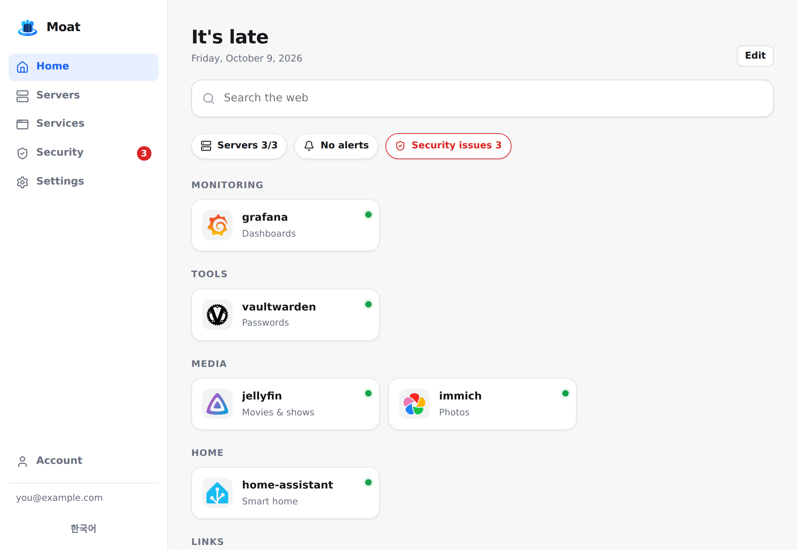
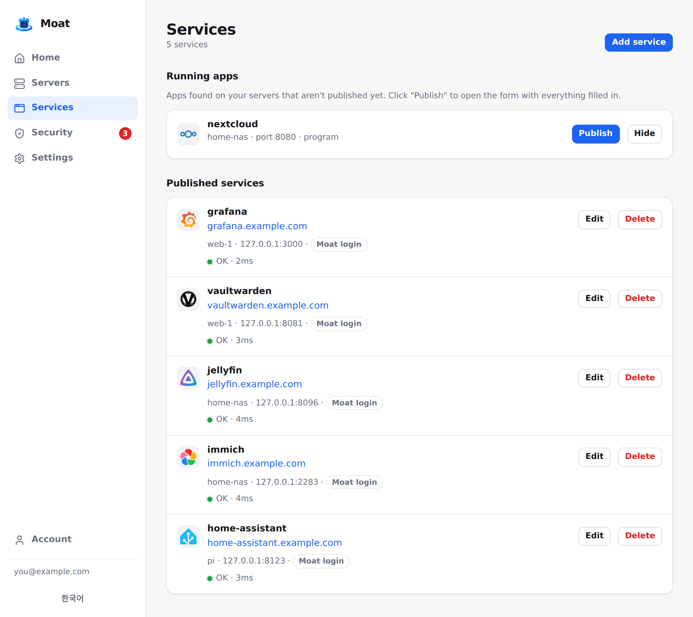
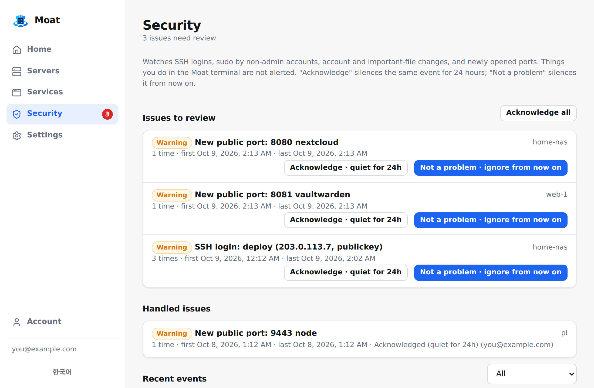

# Moat

**A secure front door for your small servers.**

Install Moat on a fresh Linux server and you get: a passkey-protected login in front of every app you
self-host, HTTPS with automatic certificates, a web terminal that lets you close SSH, security
monitoring that tells you *who did what* (and stops nagging once you've checked), resource and
service monitoring, and a home dashboard — for one server or a handful of them.

[한국어 README](README.ko.md)

<p align="center"></p>

> **Status: v0.1 — early.** Moat runs the author's own servers every day, but it is young, has a
> single maintainer and has **not had an external security audit**. Read [SECURITY.md](SECURITY.md)
> before putting it in front of anything important.

## Why Moat

Small self-hosters usually end up stitching together a reverse proxy, an auth proxy, a monitoring
dashboard, an uptime checker, a start page and an SSH setup — each with its own config and login.
Moat is one install that covers the *front door* part of that, with secure defaults:

- **Passkey login gateway** for all your apps — even apps with no login of their own. No passwords
  anywhere. Optional Google sign-in.
- **Close port 22.** The browser terminal requires a fresh passkey check (60 s), records sessions,
  and works on SELinux systems (Rocky/RHEL) as well as Ubuntu/Debian.
- **Security monitoring that knows it was you.** SSH logins and failures, `sudo` by non-admin
  accounts, account and important-file changes (`authorized_keys`, `sudoers`, `sshd_config`, …),
  newly opened ports. Things you do in the Moat terminal are attributed to you and not alerted.
  Mark an issue *Acknowledged* (quiet for 24 h) or *Not a problem* (ignored from now on).
- **Emergency exit.** One-time recovery codes, daily automatic backups, `moat-hub backup/restore`,
  and a [recovery guide](docs/recovery.md) — because closing SSH only makes sense if you can always
  get back in.

And the everyday parts:

- **Running apps → publish.** Moat lists the containers and open ports on all your servers; click
  *Publish* and it becomes `https://app.your-domain` behind your login.
- **Servers behind NAT, no port forwarding.** Every server's agent dials out to the entry over 443,
  so only the one server with a public IP needs ports 80/443 open.
- **Monitoring:** CPU, memory, disk, network, failed systemd units, containers, WireGuard peers,
  service health checks, Telegram alerts.
- **Home dashboard** with app icons (a Homepage-style start page).
- **No domain? Tailscale mode:** zero public ports, sign-in with your Tailscale identity.
- **Small:** two static binaries (Hub ≈ 12 MB, Agent ≈ 9 MB), SQLite, no Docker required.
  Runs on a 1 GB VM. English and Korean UI.

<p align="center">
  
  
</p>

## Install

On a fresh Linux server with systemd (Ubuntu, Debian, Rocky/RHEL; x86_64 or ARM64):

```sh
curl -fsSL https://github.com/5sick/moat/releases/latest/download/install.sh | sudo sh
```

The installer asks a few questions (press Enter for the recommended answer):

1. **How will you reach Moat?**
   - *Inside Tailscale only* — no domain, no public ports. Needs [Tailscale](https://tailscale.com)
     installed and logged in on the server.
   - *Public on the internet* — your domain (point `moat.example.com` and `*.example.com` at the
     server) and ports 80/443 open.
2. **Recommended setup or choose features** (monitoring, service checks, web terminal, security
   monitoring).

It then installs the Hub and this server's agent, checks access, and prints an invitation link
(create your passkey there) and your **recovery codes — write them down off the server**.

Add more servers from **Servers → Add server**: you get a one-line command; the new server asks
nothing and takes its settings from the Hub. Non-interactive install:
`sudo sh -s -- --mode public --domain moat.example.com --email you@example.com --yes`.

## How it works

```
             Internet
                │ 80/443
        ┌───────▼────────┐   Entry (edge): the agent on a server with a public IP
        │  TLS + ACME    │   reverse proxy, automatic certificates,
        │  reverse proxy │── login check against the Hub (forward auth)
        └───┬────────┬───┘
            │        │ agent tunnel (outbound wss from each server)
            ▼        ▼
   ┌───────────┐  ┌───────────┐   ┌───────────┐
   │  Hub      │  │  Agent    │   │  Agent    │   (home server behind NAT,
   │  web UI   │  │  metrics  │   │  apps     │    cloud VM, Raspberry Pi…)
   │  login    │  │  terminal │   │  terminal │
   │  SQLite   │◄─┤  security │   │  security │
   └───────────┘  └───────────┘   └───────────┘
        ▲ every agent keeps one outbound WebSocket to the Hub (Ed25519 identity)
```

- **Hub** (C++20 / Drogon): web UI, API, passkey/WebAuthn login, sessions, audit log, alerts.
- **Agent** (Go): runs on each server; collects metrics and security events, runs the web terminal,
  and on the entry server acts as the HTTPS reverse proxy. Updates itself from the Hub.
- If the Hub goes down, public apps keep working from the entry's saved routing table;
  login-protected apps fail closed. See [docs/recovery.md](docs/recovery.md).

## How it compares

| | Moat | Pangolin | Nginx Proxy Manager + Authelia | Coolify / Dokploy | Beszel / Uptime Kuma |
|---|---|---|---|---|---|
| Reverse proxy + automatic HTTPS | ✓ | ✓ | ✓ | ✓ | – |
| Login in front of any app | ✓ passkeys | ✓ | ✓ | – | – |
| Servers behind NAT without port forwarding | ✓ | ✓ | – | – | – |
| Web terminal to replace SSH (re-auth, recording) | ✓ | – | – | partial | – |
| Security monitoring with acknowledge/ignore | ✓ | – | – | – | – |
| Resource / service monitoring | ✓ basic | – | – | partial | ✓ deeper |
| Deploy apps (build, Git, compose) | – | – | – | ✓ | – |

Moat doesn't deploy your apps — use Docker Compose, Coolify or anything else, then publish them
through Moat. If you need deep metrics, keep your monitoring stack; Moat aims for "enough".

## Advanced

- `moat-agent expose 3000 [--public]` on a server publishes a local port in one line (like
  `tailscale serve`); allowed only for the server's own ports and names under your base domain.
- Services support path-prefix routing, redirects, HTTPS upstreams (including self-signed), custom
  Host header and timeouts.
- `moat-hub recovery-codes`, `moat-hub invite`, `moat-hub backup`, `moat-hub restore` for the
  command line. Every command has `--help`.

## Building from source

Requirements (Ubuntu 26.04): `build-essential cmake ninja-build pkg-config golang-go libcbor-dev
libdrogon-dev libssl-dev libsqlite3-dev libcurl4-openssl-dev libjsoncpp-dev uuid-dev zlib1g-dev`
(plus the Drogon dependencies `libpq-dev libmariadb-dev libhiredis-dev libyaml-cpp-dev
libc-ares-dev libbrotli-dev`).

```sh
make test        # Hub + agent unit tests
make e2e         # end-to-end tests (fake Google, real Chromium passkeys, agents, edge, tunnel)
make hub         # build/hub/moat-hub
make agent       # dist/moat-agent-linux-{amd64,arm64}
make hub-static  # portable static Hub (Docker, Alpine/musl)
```

Layout: `hub/` C++ Hub · `agent/` Go agent · `web/` web UI (embedded in the Hub) ·
`deploy/` install scripts · `docs/` design notes · `tests/e2e/` end-to-end tests.

## License

[AGPL-3.0](LICENSE). Third-party components are listed in
[web/THIRD_PARTY_LICENSES.md](web/THIRD_PARTY_LICENSES.md) and in the `THIRD_PARTY_LICENSES-*.txt`
files attached to each release.
